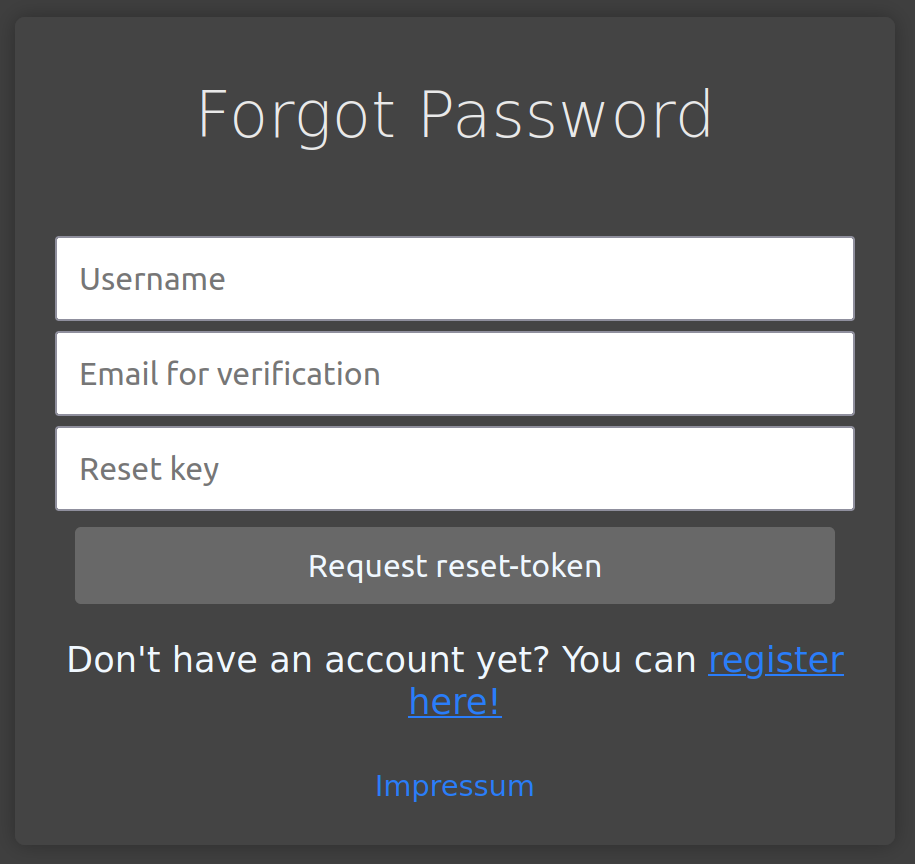

# Readme

SCRIPT (Step-based Coding for Research and Interactive Programming Training) is an Intelligent Tutoring System for programming. In this REDAME, you will find information on how to start using, contributing or hosting SCRIPT. This software is developed and maintained by the Knowledge Representation and Machine Learning (KML) group of Bielefeld University (https://www.uni-bielefeld.de/fakultaeten/technische-fakultaet/arbeitsgruppen/kml/).

## License

"SCRIPT" is an Intelligent Tutoring System for Programming.
Copyright (C) 2025  Benjamin Paaßen, Jesper Dannath, Alina Deriyeva

This program is free software: you can redistribute it and/or modify
it under the terms of the GNU General Public License as published by
the Free Software Foundation, either version 3 of the License, or
(at your option) any later version.

This program is distributed in the hope that it will be useful,
but WITHOUT ANY WARRANTY; without even the implied warranty of
MERCHANTABILITY or FITNESS FOR A PARTICULAR PURPOSE.  See the
GNU General Public License for more details.

You should have received a copy of the GNU General Public License
along with this program.  If not, see <https://www.gnu.org/licenses/>.

## Feature List

- [x] Online code-editor based on Monaco code editor
- [x] Display tasks and feedback with markdown
- [x] User management and data-collection settings
- [x] Save code execution using Jugde0
- [x] Program evaluation/submission based on unit-tests
- [x] Run programs with custom parameters
- [x] Users can send feedback requests to an ollama LLM-server
- [x] Print, function and multiple-choice tasks
- [x] Multiple courses per user
- [x] E-Mail based login
- [x] Upload courses
- [x] Conceptual Feedback on Steps
- [x] Course settings
- [x] Task selection based on user competency
- [x] Tasks with image-files
- [ ] Learning progress dashboard
- [ ] Fill the gap-tasks
- [ ] Course enrollment system

## How to use?

At this point, SCRIPT is still in an alpha stage.

### Learners

#### Registration

At registration, learners have to enter an email-adress for account verification. The email-adress is only stored until the user has succesfully verified (afterwords it will be hashed and encrypted for cases of a password reset).  On registration, learners must select, whether they want their intermediate steps to be stored in the database and whether they allow the usage of their system data for research purposes. 

{width=300}

#### Login

Users can log in to the selected course with their username and password. 

{width=300}

#### Reset Password

To reset their password users have to enter their mail, their username and the password reset token they received via email on registration.

{width=300}

#### Tutoring View

The tutoring view is the main view within a particular course. It allows for solving and navigating tasks. The task description is displayed in the upper left corner, different feedback and result types are displayed in the lower left corner. On the right side, the code editor allows for entering solutions to tasks. The action panel on the bottom allows for three actions: "Run", "Feedback" and "Submission". 

{width=500}

The "Run" button allows for the execution of the learner program with custom parameters. The "Submit" functionality will run unit tests on the current solution and display the results to the learner in the feedback panel. The "Feedback" button will send a Feedback request to the backend. Depending on the course settings, feedback on the current learner program will then be generated.

#### Profile View

The user profile can be reached over the navigation bar. It displays basic information about the user profile. Also, the user profile allows for reviewing and re-setting the data-collection preferences that were originally set during registration.

{width=300}

## How to deploy?

There are two options for deployment. The first one deployment through Docker and the second one is local deployment. We recommend deployment through Docker for testing out the system and local deployment for development.

### Deployment through Docker

1. Clone the repository

2.  Install required software

    - Docker, Docker-compose

3. Set up a .env file in the repo's root folder

Example: 

'''
ITS_ENV="development-docker"

DB_SERVICE_PW="SECRET"
DB_ROOT_PW="SECRET"

JWT_SECRET="SECRET"
USER_VERIFICATION_SECRET="SECRET"
RESET_PWD_SECRET="SECRET"
'''

4. Open a terminal inside the repo and run "docker-compose up"

### Local Deployment

1. Clone the repository

2.  Install required software

    - Docker, Docker-compose
    - MongoDB (5.x)
    - NodeJs
    - Angular CLI
    - Judge0 (Best install through the provided judge0/docker-compose.yml)

3. Set up a .env file in the repo's root folder

Example: 

'''
ITS_ENV="development"

DB_SERVICE_PW="SECRET"
DB_ROOT_PW="SECRET"

JWT_SECRET="SECRET"
USER_VERIFICATION_SECRET="SECRET"
RESET_PWD_SECRET="SECRET"
'''

4. Set up a user in MongoDB with read and write access to "its_db"

'''
use admin
db.createUser(
  {
    user: "backend_service_user",
    pwd:  "SECRET"
    roles: [ { role: "readWrite", db: "its_db" }]
  }
)
'''

5. Install python requirements in /api/requirements.txt, it is recommended to use a virtual python environment like conda. 

6. Run "npm install" in frontend/its_ui

6. Start the system by running start_app.py

#### Setting up an (admin) user.

#### Loading a course to the system

#### Setting up the LLM Server

## Contributing

We welcome external contributors to this project. If you want to contribute, we are happy to assist with questions regarding the integration of your contribution with our system. In any case, contributions should align with the general system architecture.

## Contributors

### Active Contributors

- Alina Deriyeva (primary)
- Arno Gaußelmann
- Benjamin Paaßen
- Jesper Dannath (primary)

### Additional Contributors

- Aliena Strathmann
- Björn Buschkämper
- Tobias Hillmer
