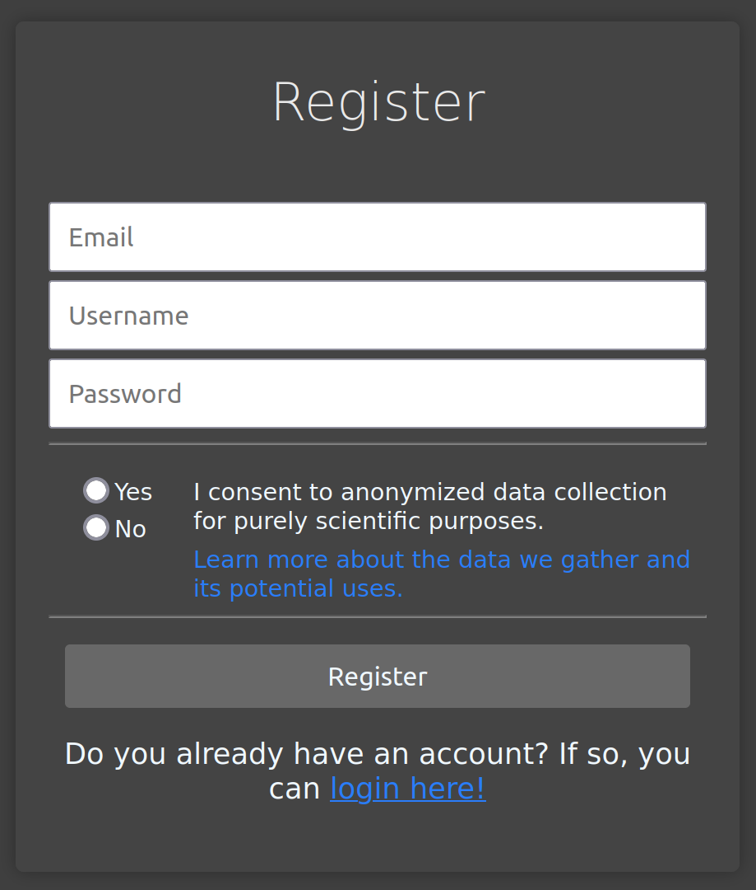

# Readme

Curious Camel is an Intelligent Tutoring System for programming. In this file, you will find information on how to start using, contributing or hosting Curious Camel. This software is developed and maintained by the Knowledge Representation and Machine Learning (KML) group of Bielefeld University (https://www.uni-bielefeld.de/fakultaeten/technische-fakultaet/arbeitsgruppen/kml/). 

## License

This software is distributed under the xxxx license. It shall not be redistributed commercially. The source code shall not be used in proprietary systems unless permission is granted by the KML group. 

## Feature List 

- [x] Online code-editor
- [x] Display tasks and feedback with markdown
- [x] User management and data-collection settings
- [x] Save code execution using Jugde0
- [x] Program evaluation/submission based on unit-tests
- [x] Run programs with custom parameters
- [x] Users can send feedback requests to an ollama LLM-server
- [x] Print, function and multiple-choice tasks
- [ ] E-Mail based login
- [ ] Tasks with image-files
- [ ] Multiple courses per user
- [ ] Course settings
- [ ] Task selection based on user competency
- [ ] Fill the gap-tasks

## How to use?

At this point, the feature set of Curious Camel is limited. To maintain courses within the system, it is currently necessary to administrate the server directly. Therefore, this manual features two user groups: students and administrators. 

### Learners

#### Registration

At the current stage, learners should know which course they want to attend pre-registration. At registration, learners can select their course in a dropdown menu. On registration, learners must also select, whether they want their intermediate steps to be stored in the database and whether they allow the usage of their system data for research purposes. 

#### Login

Users can log in to the selected course with their username and password. At this moment, passwords cannot be reset.

#### Tutoring View

The tutoring view is the main view within a particular course. It allows for solving and navigating tasks. The task description is displayed in the upper left corner, different feedback and result types are displayed in the lower left corner. On the right side, the code editor allows for entering solutions to tasks. The action panel on the bottom allows for three actions: "Run", "Feedback" and "Submission". 

The "Run" button allows for the execution of the learner program with custom parameters. The "Submit" functionality will run unit tests on the current solution and display the results to the learner in the feedback panel. The "Feedback" button will send a Feedback request to the backend. Depending on the course settings, feedback on the current learner program will then be generated.

#### Profile View

The user profile can be reached over the navigation bar. It displays basic information about the user profile. Also, the user profile allows for reviewing and re-setting the data-collection preferences that were originally set during registration.

### Admins

#### Installation

#### Loading a course to the system

#### Setting up the LLM Server

## Contributing

We welcome external contributors to this project. If you want to contribute, we are happy to assist with questions regarding the integration of your contribution with our system. In any case, contributions should align with the documented system architecture guidelines provided in the ..... files.