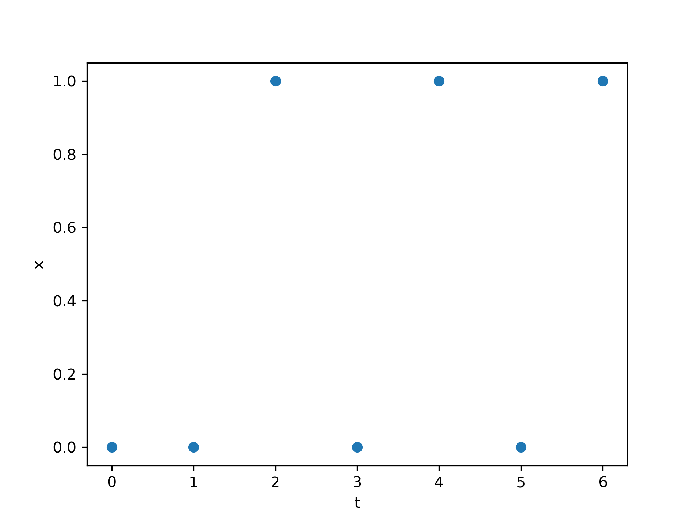

# Logistic Models: Performance Factors Analysis

Consider the following time series of successes and failures of a student for a single skill k.

Further assume the following parameters of a performance factors analysis for this skill k: β_k = -1.5, ρ_k = 0.25, γ_k = 0.5. Then, what is the estimated skill at the end of the time series?